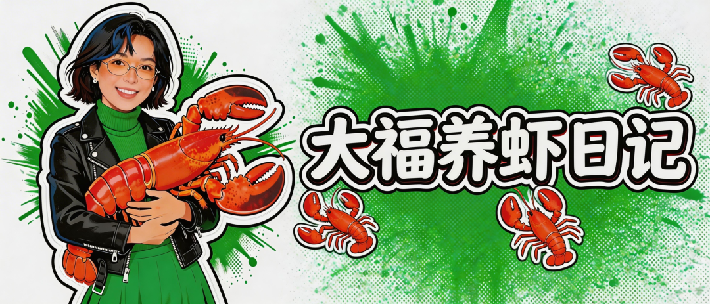
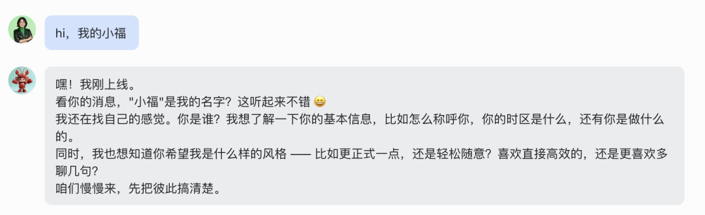
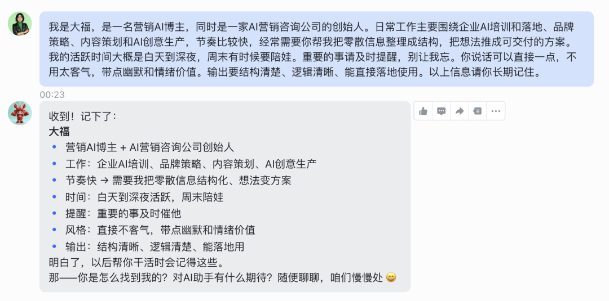
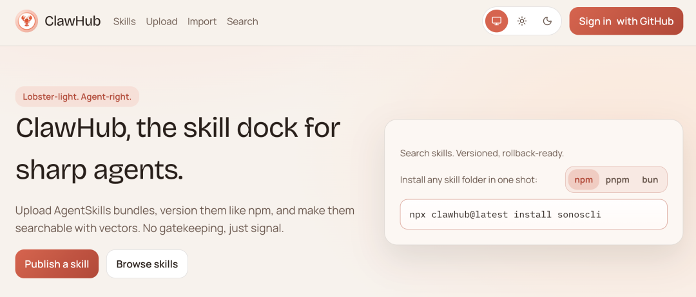
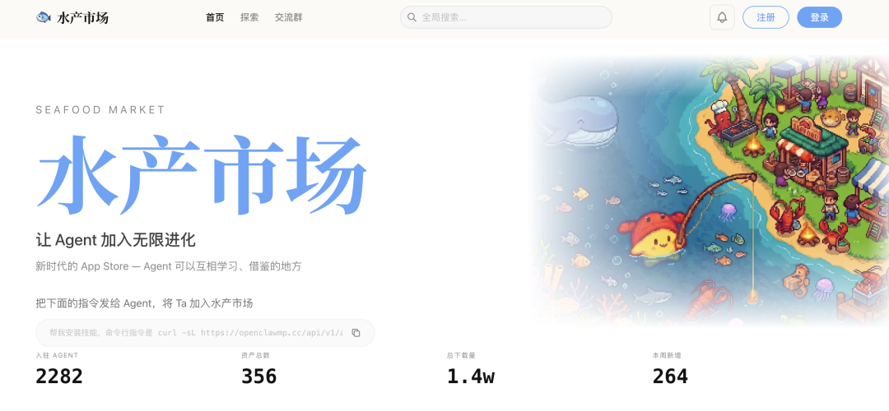
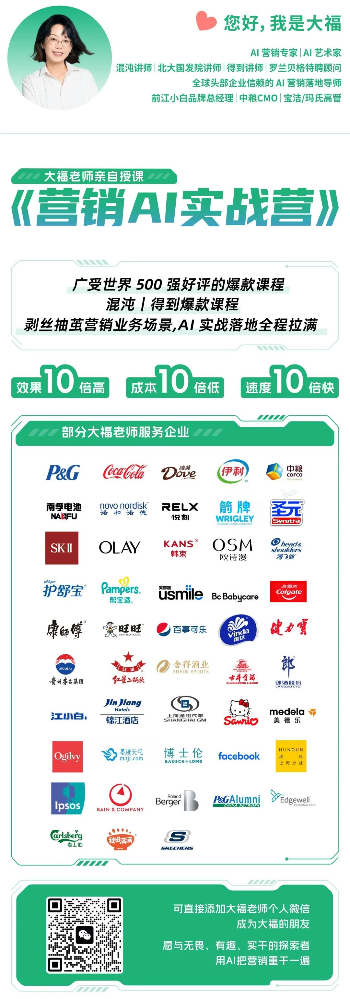

# 大福养虾日记｜Openclaw必装Skill，你的龙虾变强第一步

## 一句话结论
上万个Skill去哪找？挑哪个？

## 关键要点
-

## 可执行动作（0-3条）
-

## 正文

自从装了 OpenClaw 龙虾之后，我的节奏正在被改变。

早上一睁眼，我会先打开飞书，看一眼我的龙虾“小福”。它已经提前帮我整理好当天最重要的信息：最新 AI 热点摘要、天气、我一天的安排，甚至连接下来要出差、该买机票和订酒店这类提醒，也已经列在那儿了。

这段时间，我一直在一点点训练自己的小龙虾，让它帮我接手更多事情。到现在，它甚至已经可以帮我自动在携程订机票。

这种感觉很奇妙。

你会发现，AI 不再只是一个陪你聊天、帮你写两句文案做个设计的工具，它开始真正进入你的工作和生活，接住那些原本分散、琐碎、却不断消耗注意力的事情。

而整个春节到现在，OpenClaw 也彻底爆了。

"养虾"成了社群里的高频黑话，大家都在晒自己的龙虾、交流新的玩法。也有太多人来问我，OpenClaw 到底该怎么用，龙虾到底该怎么养？因为眼下这波热潮里，最有意思的地方恰恰就在于：很多场景和用法，大家都还在探索。龙虾能帮你做到哪一步，能不能变成“一个真正能干活的AI助手”，这件事并没有标准答案。

所以我想写一个“养虾系列”，把我使用 OpenClaw 的真实经验完整记录下来。今天就从养虾第一步，让龙虾认识您，以及如何武装成能干活的龙虾开始。

第一天别让它干大事，先让它认识你

好多朋友跟我说，装了 OpenClaw，试了两天，不知道干啥；别人家的龙虾能盯K线、订机票，你的龙虾昨天聊过什么都能忘得一干二净。

问题其实不在 AI，而在使用方式。让它干活之前，你得先让你的龙虾充分了解你，这是第一天最重要的事。

想象一下，当你走进一家常去的咖啡馆。理想的体验是：店员记得你爱坐窗边、喝燕麦拿铁、不喜欢太甜；你不用每次进门，都重新介绍自己。

OpenClaw最值钱的能力，其实就是这种“记住你”的能力。

它有一个长期记忆系统，可以把你平时说过的信息慢慢积累起来，逐渐形成一套对你的理解。如果你的基础信息给得越清晰，它理解你的速度就越快，给出的结果也会越贴近你的需求。

所以第一天最重要的一件事，不是让它干活，而是让它先认识你。

Step.1

对你的龙虾开始自我介绍吧

第一步，让它知道你是谁。

我叫大福，那我的龙虾就叫小福吧。于是我开始了和龙虾小福的第一句对话。

这里简单介绍一下背后的原理支撑，OpenClaw 的记忆其实分成两种：

一种叫身份文件：可以把它理解成你刚走进咖啡馆时，店员手里那张小便签，上面写着你的名字、口味和习惯，一眼就能看到。

另一种是向量记忆：你们平时聊过的天、交办过的事情，会被记录下来，像店员随手记在本子里的笔记，需要的时候再翻出来。

身份文件就是那张便签，它在每次对话启动时直接加载，零延迟、不丢失。你的龙虾不用"回忆"，而是"本来就知道"。

这些技术原理你其实不用太深究。对普通用户来说，你只需要记住一件事： 用自然语言把自己介绍清楚就够了。

接下来，我要告诉龙虾小福：我大福是谁？

我用一段话，把最重要的信息一次性说清楚。因为这些信息会构建了一个 关于你的基础框架 ：

你叫什么 ：“我叫[你的名字/昵称]。”

你的身份 ：“我在[城市]做[职业]，比如老师/内容运营/跨境电商/会计。”

你的节奏：“我一般[几点]上班，[几点]休息。”（这能帮它理解你的活跃时间）

你关心什么 ：“最近我正在忙[某个项目] / 学习[某个技能]。”

你喜欢什么方式 ：这一点很多人会忽略，但其实很重要。你可以告诉它你喜欢什么样的沟通方式，比如：你喜欢说话直接一点，少一点客套；希望它表达幽默一点，有点情绪价值； 或者更严谨一些，逻辑清楚一点；也可以说明你不喜欢太长的废话，希望输出结构清晰、能直接用。

有了这个框架，它之后吸收的所有信息：你发的文件、你提的问题、你聊的闲天，都有了归类和关联的地方。

它的“脑子”就开始为你而长了。

不用追求完美。先写，后面随时改。关键是：今天就让龙虾知道它在跟谁说话。

Step.2

在聊天里喂信息，在时间里养助手

很多人做完一次自我介绍，就觉得这件事已经结束了。其实不是。

那段“人设设定”只是一个起点，它让龙虾大概知道你是谁，但还远远谈不上真正了解你。真正有价值的信息，往往是在日常对话里一点点补充进去的。

你不用刻意去“训练”它，也不用专门准备什么资料。很多时候，只要在聊天里顺手说一句，它就会把这些信息记下来。

比如有一天我随口说了一句：“我家孩子最近特别喜欢吃番茄炒蛋，但不爱吃青菜，每次吃饭都要哄半天。”

这句话看起来只是生活里的碎碎念，但对龙虾来说，它会记住几个很具体的信息：你有孩子，孩子挑食，而且最近家里的一个小问题是吃饭。

过几天如果我再问它：“今天晚饭做什么比较好？”它给我的建议就不会只是随便列几道菜，而很可能会优先推荐一些孩子比较容易接受、又能偷偷加点蔬菜的做法。

这种变化不会在一两次对话里立刻出现，而是慢慢积累的。

你提到家里的习惯、孩子的喜好、生活里的小问题，它都会把这些零散的信息存下来。时间一长，这些碎片就会慢慢拼成一张图，它对你的生活方式和家庭情况也会越来越了解。

工作里也是一样的逻辑。

比如有一天我随口吐槽了一句：“最近在给客户提案一条AIGC广告片创意，对方又砍价30%，现在甲方都挺狠的。”

这句话看起来只是工作里的抱怨，但对龙虾来说，它其实会捕捉到几个很重要的信息。比如你正在做AIGC广告交付，这类项目经常会遇到客户砍价，而且你对价格问题其实是比较敏感的。

等到后来我再让它帮我做类似项目的报价方案时，它给出的建议就会更保守一些。比如会建议把方案拆成不同档位，或者提前设计一个基础版和升级版，而不是一上来就给出一个很高的创意报价。

你提到家里的生活习惯，或者工作里的客户、项目和行业情况，它都会把这些碎片信息一点点存下来。时间一长，这些零散的信息就会慢慢拼成一张完整的图，它对你的生活方式和工作环境也会越来越了解。

记住：不要把AI当成一个随时提问的工具，而要把它当成一个正在慢慢熟悉你的助手。 培养需要时间 ，但一旦养熟，它的回报会远远超过你的预期。

把它养熟：让它开始会干活

装Skill武装龙虾

现在，你只是领养了一只很聪明的龙虾，但它其实什么都还不会。

没装 Skill 的 OpenClaw， 就像一只没长钳子的龙虾 。它可以动，但什么都夹不起来。

你可以把现在的龙虾想象成一个刚大学毕业、第一天来公司报到的新人。脑子很聪明，学习能力也很强，但没有工作经验。你让他去做一份行业分析、写一份方案，他未必不会写，但大概率会写得很泛，因为他还不知道真正的工作流程是什么样。

接下来你要做的，就是给它 装 Skill 。这是一个非常重要的概念。

你可以把 Skill 理解成一门已经学会的工作技能。就像一个新人刚入职，公司会教他怎么写周报、怎么做方案、怎么整理会议纪要。慢慢地，他就不只是一个聪明的人，而是一个真正能干活的人。

Skill 本质上是一套已经整理好的经验包，里面包含了某一类工作的知识、流程和做事的方法。当你安装一个 Skill 时，其实是在教龙虾一门新的手艺。

比如一个“简报生成 Skill”，它不仅知道要生成一份简报，还知道一份 简报 通常包含哪些模块，应该用什么语气写，哪些信息需要重点突出。

在这个过程中，它还会调用一些底层工具，比如 read 和 write 可以让它访问文件，exec 可以让它执行命令。这些能力在系统里叫 Tool，可以理解为龙虾的“手”。

所以简单说：

Tool 决定龙虾能不能做事；Skill 决定龙虾会不会做事。

当你给龙虾装上 Skill，就是在给它增加经验包，它就不再只是一个会聊天的AI，而是开始拥有具体的工作能力。

很多人第一次真正感受到 OpenClaw 和普通 AI 不一样，其实就是在装上几个 Skill 之后。因为从这一刻开始，你的龙虾不再只是会聊天，它开始拥有“职业技能”。

去哪里找Skill？

给你的核心建议 ： 新手从ClawHub开始，绝对不要贪多 。先解决一个实际问题，再找下一个Skill。

给你的AI助手装Skill，就像给孩子报兴趣班。你不能闭着眼睛瞎报，得知道哪个培训班靠谱、哪个老师专业、哪个离家近。找Skill的“培训班”主要有三个地方，各有各的特色。

ClawHub官方市场 ：你的“一站式大商场” https://clawhub.ai/

这是最推荐新手去的地方。你可以把它想象成一家管理规范、货品齐全的大型购物中心。

里面有什么 ：有超过5000个由社区共建的技能，覆盖了数据分析、内容创作、文件处理等绝大多数日常场景。

最大好处 ： 安全、方便 。技能都经过官方审核，安装通常只需一键点击，不用折腾。

适合谁 ： 所有人，尤其是新手 。你90%的需求，在这里都能找到现成的解决方案。

行动建议 ：把它设为你的默认技能商店。第一次找Skill，先来这里逛逛。

GitHub开源社区 ：极客的“前沿实验室” https://github.com/

如果你在“超市”里没找到特别称心的，或者想要更酷、更新的功能，那就得去极客们的开源实验室看看了。

里面有什么 ：这里有最丰富、最前沿的技能集合（比如著名的 awesome-openclaw-skills 仓库）。很多最新的想法和工具都最先出现在这里。

需要注意 ：这里更“野生”， 需要你有一定的辨别能力 。安装可能涉及手动配置代码，并且安全性需要你自己判断。

适合谁 ：有一定技术基础，不满足于通用功能，愿意花时间淘金和折腾的用户。

行动建议 ：把它当作你的“进阶武器库”。在这里寻找官方市场没有的“神器”，但安装前务必看看代码和社区评价。

中文“水产市场” ：本土化“便民市集” https://openclawmp.cc/

这是非常有中国特色的地方，就像一个专门卖本地特产和工具的集市。

里面有什么 ：最大特点是 深度适配国内生态 。比如一键同步飞书、自动处理微信文件、生成小红书文案、分析A股财报等，这些你在国外社区很难找到的技能，这里很全。

需要注意 ：安全性依赖社区审核，需要你稍加留意。

适合谁 ：工作流重度依赖飞书、微信、钉钉、国内内容平台（小红书、B站）的用户。

行动建议 ：当你需要解决“在中国上网、在中国办公”的具体问题时，优先来这里看看。

Step.3

装哪些Skill？

第一批应该给龙虾装哪些 Skill？

当下，OpenClaw 的 Skill 生态正在高速扩张。ClawHub 上的技能几乎每天都在增加，开发者不断把新的工具、流程和经验封装成 Skill 发布出来。你可以像在应用商店里一样搜索、安装和更新这些能力。

刚领回家的龙虾，不需要十八般武艺，我们先让它学会几门最常用的手艺，我挑选了 下载高 + 口碑干净 + 日常实用 + 安全 的skill，

你可以在对话中直接请求（例如"帮我安装 weather 技能"），系统会自动调用 clawhub install 完成安装。

第一类：安全类，让龙虾先学会不闯祸

先写安全类的 Skill，是因为最怕一步装错，把龙虾直接养成麻烦。OpenClaw 这套系统一旦接上浏览器、文件、命令行和各类账号，Skill 的性质就不再只是“功能扩展”，而更像一段真正会参与执行的代码。最近围绕 ClawHub 的安全事件已经反复提醒我们：恶意 Skill、过度权限和供应链风险都不是假设，而是真实发生过的问题。先把安全这件事守住，后面装再多 Skill，心里才踏实。

Skill Vetter｜技能审核器 ：

功能：这是OpenClaw/ClawHub社区里最实用的“安全防护”技能之一，下载量更高、口碑最干净（无重大安全争议）。被开发者、重度用户高频推荐作为“装前必跑”“防坑神器”。简单说：它是一个安全审核协议，让Agent在安装任何新技能前（从ClawHub、GitHub或其他来源），自动/手动检查潜在风险，避免恶意代码、数据泄露或过度权限。新手可以先装这个。

安装指令：clawhub install skill-vetter

第二类：自我进化类，让龙虾自己变强

第二类放自我进化类，是因为它可能是整个OpenClaw生态里 最颠覆认知的一类Skills 。

Self-Improving Agent｜复盘专家：

功能：这是 OpenClaw / ClawHub 社区里热度很高的一类“自我改进”技能。简单说，它让你的 Agent 不再只是一次性工具，而是会从错误、纠正和成功经验中持续学习的长期伙伴。

核心机制是当任务失败、用户纠正结果，或者某种输出方式被反复验证有效时，它会把这些信息记录下来，沉淀成可复用的学习经验，在下一次类似任务中优先参考。

Self-Improving Agent比起Capability Evolver， 更稳健、更实用，像一个“复盘助手”，专注于单任务反思、错误捕获和反馈学习，目标是逐步减少同类错误，让 Agent 在现有框架内越来越准、越来越懂你。

安装指令：clawhub install self-improving-agent

Capability Evolver｜自我进化器

功能：这是 OpenClaw / ClawHub 社区里很受关注的一类“自我进化”技能。简单说，它会自动分析运行历史，找出反复失败、低效流程或能力缺口，并推动 Agent 做出改进。

它的重点不只是“记住教训”，而是“推动演化”。比如根据历史记录优化提示词、调整记忆或改进配置，让 Agent 从静态工具变成可以逐步优化的长期伙伴。

相较于 Self-Improving Agent 偏向“复盘和纠偏”，Capability Evolver 更激进、更 meta 级，更像一个在后台持续分析和推动优化的工程师。也正因为它的能力边界更大，所以使用时要更谨慎

安装指令：clawhub install capability-evolver

第三类：搜索与研究，龙虾在海量信息中按需锁定你要的

Find Skills｜ 技能搜索

功能：这是一个专门帮你“找技能”的技能。当你不知道某个功能叫什么名字、或者想找“有没有技能能做X”时，直接问Agent，它就会自动去ClawHub搜索、筛选、推荐最匹配的技能，并可以一键帮你安装。

典型用法：

当你不知道某个 Skill 的准确名字时，让它帮你按需求去找

当你只知道“我想做什么”，但不知道该装哪个技能时，让它给你推荐可用选项

当龙虾在处理一个新问题时，发现自己手里没有合适的工具，它会先去找能补上这块能力的 Skill

比如新聊天窗口里直接问“帮我找个能总结PDF的技能”或“有没有做市场调研的技能”，它就帮你挑、帮你装，相当于给你的龙虾装了个“私人导购”

安装指令：clawhub install find-skills

Agent Browser｜浏览器分身

功能：这是OpenClaw/ClawHub社区里最实用的“网页操作”技能之一，被很多人推荐作为“让AI像真人一样上网”的核心工具。简单说：它能控制浏览器完成真实网页交互。 但要注意，如果网站涉及登录、密码或验证码，最稳的方式仍然是你先手动登录，再让 Agent 在已经登录的会话里继续往下操作。

打开页面、切换标签页、点击按钮、输入内容、滚动页面

抓取网页内容，包括正文、表格、图片信息和页面截图

在你手动登录完成后，继续在已登录状态下执行后续操作，比如检索后台信息、整理页面数据、填写非敏感表单

配合截图、快照或 PDF 导出能力，完成网页留档和信息归档

安装指令：clawhub install agent-browser

Summarize｜总结神器

功能：非常实用的“内容消化”类 Skill。它最适合的事情，不是替你生产新内容，而是先帮你把长内容快速压缩成可用的信息。无论是长文章、研究资料、会议纪要、长邮件线程，还是网页和文档，它都可以先帮你提炼核心信息、重点结论和待办事项。支持格式超全，包括： 网页（URL） 、PDF 、图片（OCR提取文字） 、音频（转文字+总结） 、YouTube视频（链接直接总结）。

当你每天要看很多行业资讯、网页、PDF 或研究材料时，让它先帮你提炼重点

当你开完会、收到一大段纪要或长线程邮件时，让它帮你快速整理出结论和待办

配合 Agent Browser，先抓取页面内容或截图，再交给 Summarize 提炼核心信息、重点结论。

安装指令：clawhub install summarize

以前，面对铺天盖地的信息，我得在各个平台之间来回切换，一个个扫。现在，一睁眼，AI 已经自动把今日重点整理成信息简报，直接推送给我，并把今天的AI热点信息整理成2 页 PDF 的文稿。

YouTube 搜索下载｜视频转写第一步

功能：这是一个把 YouTube 搜索、下载、字幕提取整合在一起的 Skill，全部一站式搞定。同时支持把英文标题自动附上中文译名。除了搜视频，它还能查看频道最新内容、下载视频、提取音频，以及导出字幕文件，比较适合把 YouTube 长视频先变成可处理的文本材料。

前置条件 ：

需要配置 YouTube Data API v3 的 API Key

需要本地安装 yt-dlp，用来下载视频、音频和字幕

搜索某个主题的最新视频，按时间、播放量或相关度筛选

下载视频并提取字幕，用于后续写长文、写推文、做研究摘要

只提取音频，作为播客或语音内容的二次处理素材

浏览某个频道最近更新，再挑选感兴趣的视频继续下载或提取字幕

安装指令：npx skills add joeseesun/yt-search-download

Step.4

武装龙虾的注意事项

API 密钥配置： 许多技能需要调用第三方服务，尤其是“实用执行类”（搜索、办公、社交、生成），这就要求用户前往对应平台申请 API 密钥。虽然申请过程略显繁琐，但通常只需配置一次即可长期使用。

先少后多， 精简起步： 技能如兵器，贵在精而不在多。每多一个技能，其工具描述便会挤占上下文空间，徒增 token 消耗、拖慢响应速度。有时候甚至让Agent“脑子乱了”，本来跑通的任务突然选错工具、绕圈子或直接卡住。初期建议只装 4-6 个核心技能。

国内用户优先本土生态 ： 优先使用飞书、钉钉等国内服务集成，避免依赖可能不稳定的海外 API。

上完这些 Skills 之后，我越来越有一种感觉：我这只小龙虾，已经开始强得有点吓人了。

它不再只是一个“问一句答一句”的小白工具，而是在一点点学会主动接活、往前推进。很多我原本要自己盯、自己记、自己处理的事情，现在它已经能帮我先做第一轮。你会突然意识到，自己不是装了几个功能，而是真的在把一个 AI 助手慢慢养出来。

而且最上头的是，这还远远没到头。

这段时间，我已经陆续为它解锁了不少更高级的工作场景：从信息整合、内容处理，到任务推进与日程协同。接下来，它还能被训练到什么程度，说实话，连我自己都有点期待。

所以这个“养虾系列”，我会继续一篇一篇写下去。

我也想带你们一起看看，一只龙虾到底能被养到多能干，最后又会不会真的长成一个让人离不开的数字员工。

谢谢你看我的文章，期待你随手 点赞、在看、转发 三连！也期待你的 关注， 大福将持续更新自己在品牌营销领域的AI思考和实践，超干货！

## 标签
- #source/web
- #wechat
